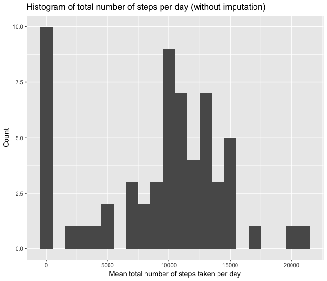
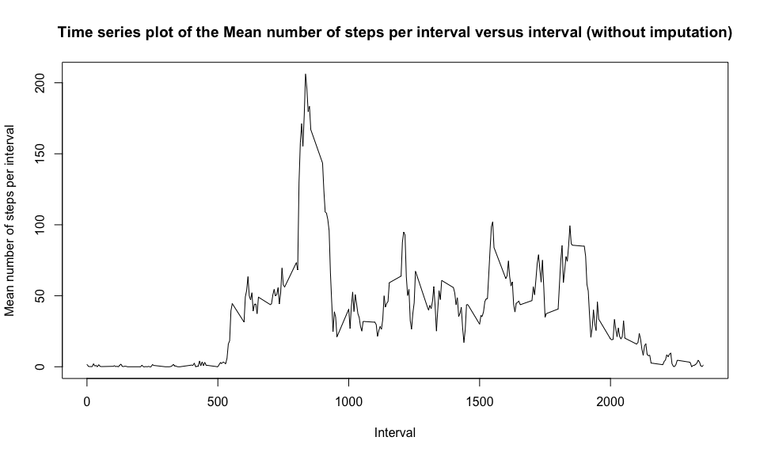
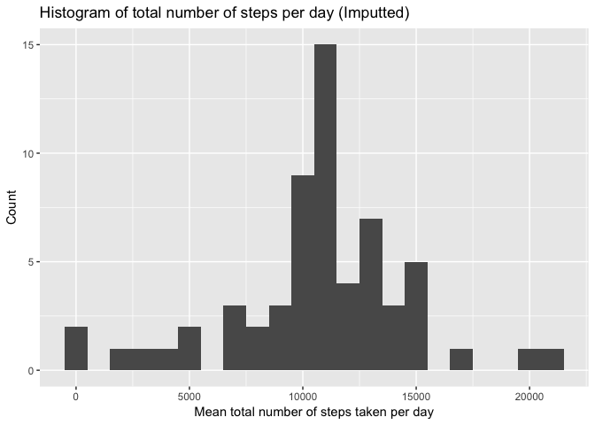
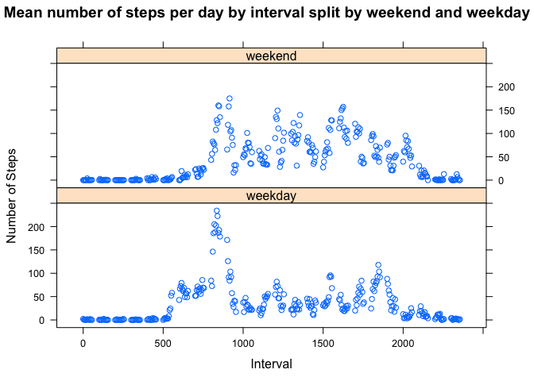

# Reproducible Research: Peer Assessment 1
Kevin Costello  
`r format(Sys.Date(), '%d/%m/%y')`  


```r
knitr::opts_chunk$set(message = FALSE, echo = TRUE, results = "asis", fig.show = "asis", include = TRUE)
```

# Loading and preprocessing the data

* Load libraries required for the assignment


```r
library(dplyr)
library(reshape2)
library(ggplot2)
library(lattice)
library(tidyverse)
library(tidyr)
```

1. Load the data (i.e. read.csv())

* Load activity.csv


```r
activity <- read.csv("activity.csv", na.strings = "NA")
```

2. Process/transform the data (if necessary) into a format suitable for your analysis

* <span style="font-family:Futura;">This step was not neccesary for my analysis.</span>

# What is mean total number of steps taken per day?

1. Calculate total number of steps taken per day

* Create groups to calculate statistics.  The statistics will be grouped by date


```r
byDay <- group_by(activity, date)
```

* Calculate total number of steps taken per day


```r
sumDay <- summarise(byDay, sumDay = sum(steps, na.rm = TRUE))
```

2. Make a histogram of the total number of steps taken each day


```r
qplot(sumDay$sumDay, geom = "histogram", xlab = "Mean total number of steps taken per day", ylab = "Count", binwidth = 1000, main = "Histogram of total number of steps per day (without imputation)")
```

<!-- -->

3. Calculate and report the mean and median of the total number of steps taken per day

* Calculate and report the mean number of steps per day without imputation


```r
meanDayTotalAllDays <- mean(sumDay$sumDay, na.rm = TRUE)
print(meanDayTotalAllDays)
```

[1] 9354.23

* Calculate report the median number of steps per day without imputation


```r
medianDayTotalAllDays <- median(sumDay$sumDay, na.rm = TRUE)
print(medianDayTotalAllDays)
```

[1] 10395

# What is the average daily activity pattern?

1. Make a time series plot (i.e. type = "l"") of the 5-minute interval (x-axis) and the average number of steps taken, averaged across all days (y-axis)

* Create groups to calculate statistics.  The statistics will be grouped by interval


```r
byInterval <- group_by(activity, interval)
```

* Calculate mean number of steps per interval


```r
meanInterval <- summarise(byInterval, meanInterval = mean(steps, na.rm = TRUE))
```

* Make the time series plot


```r
plot(meanInterval$interval, meanInterval$meanInterval, type = "l", xlab = "Interval", ylab = "Mean number of steps per interval", main = "Time series plot of the Mean number of steps per interval versus interval (without imputation)")
```

<!-- -->

2. Which 5-minute interval, on average across all the days in the dataset, contains the maximum number of steps?


```r
interval <- subset(meanInterval, meanInterval == max(meanInterval))
print(interval)
```

# A tibble: 1 × 2
  interval meanInterval
     <int>        <dbl>
1      835     206.1698

# Imputing missing values

1. Calculate and report the total number of missing values in the dataset


```r
numr <- summarise(activity, countNA = sum(is.na(steps)))
print(numr)
```

  countNA
1    2304

2. Devise a strategy for filling in all of the missing values in the dataset. The strategy does not need to be sophisticated. For example, you could use the mean/median for that day, or the mean for that 5-minute interval, etc.

* <span style="font-family:Futura;">My strategy is to replace missing values (NA) with the mean number of steps for that interval over all days.</span>

3. Create a new dataset that is equal to the original dataset but with the missing data filled in.

* Merge activity data with mean interval data


```r
byDay2 <- merge(activity, meanInterval, by = "interval")
```

* Create a new dataset that is equal to the original dataset but with the missing data filled in.


```r
byDay3 <- select(byDay2, interval, steps, date, meanInterval)
byDay3$steps[is.na(byDay3$steps)] <- byDay3$meanInterval[is.na(byDay3$steps)]
```

* Check that only the NA values have been replaced


```r
# Compare steps variable from original dataset versus imputted dataset
byDay4 <- byDay2$steps == byDay3$steps

# Count number of rows in original dataset
byDay2Nrows <- nrow(byDay2)
print(byDay2Nrows)
```

[1] 17568

```r
# Count number of rows in imputted dataset
byDay3Nrows <- nrow(byDay3)
print(byDay3Nrows)
```

[1] 17568

```r
# Check the number of rows in the original and imputted datasets are the same
byDay2Nrows == byDay3Nrows
```

[1] TRUE

```r
# Count number of times the values from the original and imputted datasets are equal
equalSteps <- sum(byDay4, na.rm = TRUE)
print(equalSteps)
```

[1] 15264

```r
# Count number of NA values for steps in original dataset
byDay2NA <- sum(is.na(byDay2$steps))
print(byDay2NA)
```

[1] 2304

```r
# Count number of NA values for steps in imputted dataset
byDay3NA <- sum(is.na(byDay3$steps))
print(byDay3NA)
```

[1] 0

```r
# Sum of the equal values in the original and imputted datasets and the NA values in original dataset should equal the total number of rows in the original dataset
equalSteps + byDay2NA == byDay2Nrows
```

[1] TRUE


4. Make a histogram of the total number of steps taken each day and Calculate and report the mean and median total number of steps taken per day. Do these values differ from the estimates from the first part of the assignment? What is the impact of imputing missing data on the estimates of the total daily number of steps?

* Create groups to calculate statistics.  The statistics will be grouped by date


```r
byDayGroup <- group_by(byDay3, date)
```

* Calculate total number of steps per day with imputation


```r
sumDay3 <- byDayGroup %>%
        summarise(sumDay = sum(steps, na.rm = TRUE))
```

* Make a histogram of the total number of steps taken each day


```r
qplot(sumDay3$sumDay, geom = "histogram", xlab = "Mean total number of steps taken per day", ylab = "Count", binwidth = 1000, main = c("Histogram of total number of steps per day (Imputted)"))
```

<!-- -->

* Calculate and report the mean number of steps per day with imputation


```r
meanDayTotalSumImpute <- mean(sumDay3$sumDay, na.rm = TRUE)
print(meanDayTotalSumImpute)
```

[1] 10766.19

* Calculate and report the median number of steps per day with imputation


```r
medianDayTotalSumImpute <- median(sumDay3$sumDay, na.rm = TRUE)
print(medianDayTotalSumImpute)
```

[1] 10766.19

# Are there differences in activity patterns between weekdays and weekends?

1. Create a new factor variable in the dataset with two levels – “weekday” and “weekend” indicating whether a given date is a weekday or weekend day.

* Convert date variable to date type


```r
weekdayData <- mutate(byDay2, asDate = as.POSIXct(date))
```

* Determine day of week each date occurred


```r
weekdayData <- mutate(weekdayData, weekday = weekdays(asDate))
```

* Create weekend variable 


```r
weekdayData <- mutate(weekdayData, weekend = ifelse(weekday %in% c("Saturday", "Sunday"), "weekend", "weekday"))
```

2. Make a panel plot containing a time series plot (i.e. 𝚝𝚢𝚙𝚎 = "𝚕") of the 5-minute interval (x-axis) and the average number of steps taken, averaged across all weekday days or weekend days (y-axis). See the README file in the GitHub repository to see an example of what this plot should look like using simulated data.

* Create groups to calculate statistics.  The statistics will be grouped by interval and weekend


```r
byIntervalGroup <- group_by(weekdayData, interval, weekend)
```

* Calculate mean number of steps per day


```r
meanIntervalImpute <- summarise(byIntervalGroup, meanDay = mean(steps, na.rm = TRUE))
```

* Calculate median number of steps per day


```r
medianIntervalImpute <- summarise(byIntervalGroup, medianDay = median(steps, na.rm = TRUE))
```

* Create panel plot of the mean number of steps per day by interval split by weekend and weekday


```r
xyplot(meanDay ~ interval | weekend, data = meanIntervalImpute, layout = c(1, 2), xlab = "Interval", ylab = "Number of Steps", main = "Mean number of steps per day by interval split by weekend and weekday")
```

<!-- -->
